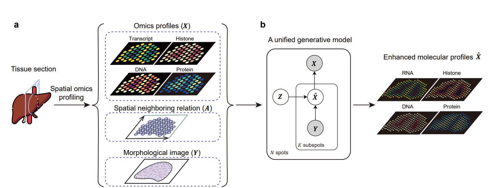

# MERF 

Multi-site reinforcing framework (MERF) is a deep learning model for antibody evolution that enables simultaneous mutations across multiple residues.

## Overview

Antibodies hold a vast potential for biomedical applications and therapeutic development primarily driven by their in vivo evolutionary mechanisms. Recent advances in artificial intelligence pave the path for computational antibody evolution by nominating single-residue mutations towards an optimized affinity. However, in nature, biological evolution is instead rooted in the simultaneous mutations across multiple residues. Modeling such multi-residue evolution remains challenging due to the vast evolutionary landscape, computational complexity, and local maxima traps. 

To address these challenges, we introduce MERF, a multi-agent reinforcement learning framework designed to efficiently explore multi-residue evolutionary space for antibody affinity enhancement. MERF redefines antibody evolution as a policy-making process rather than following traditional prediction-driven frameworks. MERF alternates between generating mutation policy and learning value function based on the binding energy change, providing an efficient reinforcing framework for discovering affinity-enhancing multi-site mutations while minimizing computational costs.



## MERF software package

MERF requires the following packages for installation:

- Python >= 3.8
- PyTroch = 1.12.1
- Numpy >= 1.23.5
- easydict = 1.10
- biopython = 1.79
- scipy = 1.10.1
- scikit-learn = 1.2.2

All required python packages can be installed through `pip/conda` command. 

To install MERF package, use

```terminal
git clone https://github.com/deng-ai-lab/MERF
```

To enable antibody evolution using the Rosetta Docking protocol, users are recommended to install Rosetta and compile it in Message Passing Interface (MPI) format, following the instructions in the [Rosetta Documents](https://docs.rosettacommons.org/demos/latest/tutorials/install_build/install_build)

After Rosetta installation, ensure the relevant environment variables are properly configured by executing:

```
export PATH="{PATH_TO_MPI}/mpi_instll/bin/:$PATH"
export PATH="{PATH_TO_ROSETTA}/rosetta.source.release-340/main/source/bin/:$PATH"
export LD_LIBRARY_PATH="{PATH_TO_MPI}/mpi_instll/lib/":$LD_LIBRARY_PATH
```

To enable antibody mutation, ensure that the required executables are accessible by running the following commands:
```
cd protein
chmod +x profix
chmod +x scap
```

## Dataset

The SKEMPI v2.0 dataset is available at [SKEMPI v2](https://life.bsc.es/pid/skempi2/), and the AB-Bind dataset can be accessed from [AB-Bind](https://github.com/sarahsirin/AB-Bind-Database).

To ensure reproducibility, we provide preprocessed structure files (after atom repair) for both wild-type and mutant Ab–Ag complexes in the `\data` directory. Users are encouraged to download and extract the provided archive from [Data](https://bhpan.buaa.edu.cn/link/AA4559117CC4E843D9BF9AC782C5D4E009) before executing the scripts.

## Usage

### Pretrain MERF

To pretrain MERF, run the `pretrain_and_val.py` script. This will train MERF on the AB-Bind dataset with built-in cross-validation and output pretrained parameters for downstream tasks.

### Antibody evolution

For evolution tasks, use `evo_abbind.py` to evolve antibodies within the AB-Bind dataset, or `evo_sars.py` to optimize antibodies targeting three major SARS-CoV-2 variants.

## Copyright
Software provided as is under **MIT License**.

Fengji Li @ 2025 BUAA and Deng AI Lab